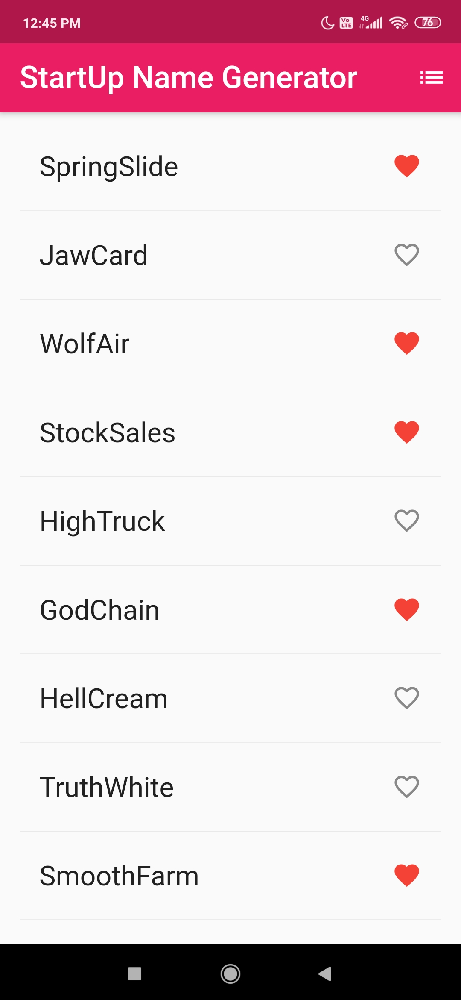
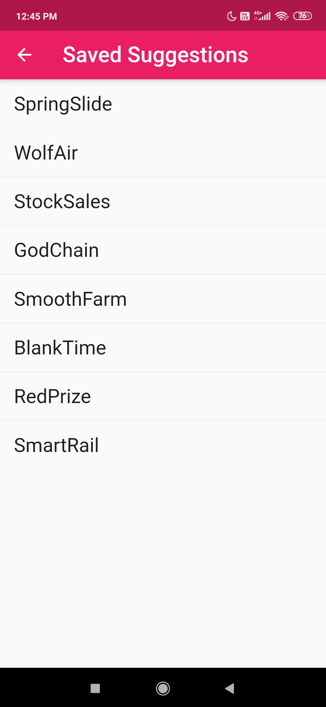

# [Flutter-StartUpNameGenerator](https://sgagankumar.github.io/Flutter-StartUpNameGenerator/)
## About
### Couldn't figure out what your start up should be called? This App is designed just for you.
Generate random Names just with one tap, Simple and Intuitive, keep scrolling infinitely until you find the one that is meant for you.
Favorite the ones that grab your attention and choose amoong them later.

## Application Information
Version - 1.0.2  
Compatibility - Andriod Kitkat and iOS 9 onwards  
Application Permisions - None  

## Technical Information
Developed Platform - Flutter with Android SDK  
Language - Dart  
System Requirements - Android 4.4 / iOS 9  
Application Size - 16MB / 26MB  

## INSTALLATION
### ANDROID
1. Download the Respective .apk file compatible with your android device. ( if unaware, use the universal installer )
  Available Versions  
  1.1 Universal Installer     - [SNG-release.apk](https://github.com/sgagankumar/Flutter-StartUpNameGenerator/blob/master/Application%20Release/Android/SNG-release.apk)  
  1.2 x86 64 bit Installer    - [SNG-app-x86_64-release.apk](https://github.com/sgagankumar/Flutter-StartUpNameGenerator/blob/master/Application%20Release/Android/SNG-x86_64-release.apk)  
  1.3 arm 64 bit Installer    - [SNG-app-arm64-v8a-release.apk](https://github.com/sgagankumar/Flutter-StartUpNameGenerator/raw/master/Application%20Release/Android/SNG-arm64-v8a-release.apk)  
  1.4 arm EBI Installer       - [SNG-app-armeabi-v7a-release.apk](https://github.com/sgagankumar/Flutter-StartUpNameGenerator/blob/master/Application%20Release/Android/SNG-armeabi-v7a-release.apk)  
2. Run the .apk on your mobile device.
3. The OS will prompt for installation from unknown sources, click **Accept**.
4. Run the Application from the App Drawer.

### iOS (MacBook Required)
1. Download the .iOS installation file from the following link   
  [App Realease iOS]  - [Download](https://github.com/sgagankumar/Flutter-StartUpNameGenerator/blob/master/Application%20Release/iOS/SNG-release.ios)   
2. Run the Installer on the iOS device using XCode (MacBook Required)
3. Run the Installed Application

## User Interface
[Open Demo Video](https://www.github.com/sgagankumar/Flutter-StartUpNameGenerator/raw/master/Screenshots/Demo.mp4)   

